   # Climate Change Website 

 - This is the main climate change website, a platform 
   designed to help individuals achieve their goals and make positive changes in their lives by creating awareness of the issues of global warming and how making some simple lifestyle changes can keep our nautral habitat and earth safe which will help improve our planet. 
- This website is responsive and accessible on a range of 
  devices, making it easier for users to navigate and find valuable content.
 
  
The site address is: [ Climate Change](https://57esther.github.io/Climate-Change/)

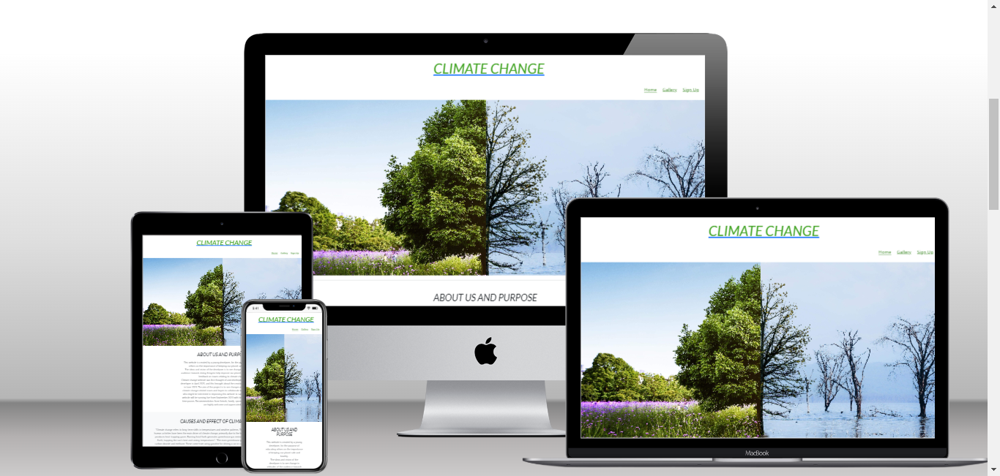

## Table of contents

1. [UX](#UX)
   - [Ideal User Demographic](#Ideal-User-Demographic)
   - [Site Purpose](#site-purpose)
   - [User Stories](#User-Stories)
   - [Development Plans](#Development-Plans)
   - [Design](#Designs)
2. [Features](#Features)
   - [Design Features](#Design-Features)
   - [Existing Features](#Existing-Features)
   - [Future Features](#Future-Features)
3. [Issues and Bugs](#Issues-and-Bugs)
4. [Technologies Uesd](#Technoloies-Used)
   - [Main Languages Used](#Main-Language-Used)
   -[Frameworks, Libraries & Programs Used](#Frameworks,-Libraries-&-Programs-Used)
5. [Testing](#Testing)
6. [Deployment](#Deployment)
7. [Credits](#Credits)
   - [Contents](#Credits)
   - [Media](#Media)
   -[Code](#Code)
8. [Acknowledgements](#Acknowledgements)

## UX

### Ideal-User-Demographic
This website targets audience around the world, because of its useful insight, ideas and information. Children and Adult age 10 and above habe found the website infomative and encouraging and finds great insight to help make positive lifestyle change.

### Site Purpose

- The purpose of the Climate Change website is  to create 
 awareness of issues affecting the planet and how daily lifestyle change can reduces the effect of these cause globally.

- ### User Stories

As a user I want:

1. A website that is easy to read and navigate.
2. Clear information about the website; purpose and need of the site, how to access content on the site.
3. To navigate the site easily and option to sign-up for update and information.

As the develpoer of the wesite I want:

1. To provide clear and relevant information regarding the website.
2. To provide a place for people to ask any questions they might have regarding climate issues.
3. To provide information on how to reduce/stop the effect of cimate change.

### Goals

#### Visitor Goals.

-  #### First Time Visitors Goals-

    - As a First Time Visitor, I want to easily understand the purpose of the website.
    - As a First Time Visitor, I want to be able to easily navigate throughout the website to find content.
    - As a First Time Visitor, I want to locate their social media links to follow them on social media.

 -  #### Returing Visitors Goals

    - As a returning Visitor, I want to find new information about the website.
    - As a returning Visitor, I want to find the best way to sign up to newsletter on the website.
    - As a returning Visitor, I want to find new updates and  links to information.

-   #### Frequent Visitor Goals

    - As a Frequent Visitor, I want to check to see if there are any newly added resources.
    - As a Frequent Visitor, I want to sign up to newsletter or events to stay updated with information 
     about improving our planet.

    - As a Frequent Visitor, I want to find the best way to locate the events hosted on the website.

-  #### Business Goals

 ##### The business goals are:

- To attract more people who would want to collaborate to bring this project to the world.
- To secure sponsorship opportunity for future development of the project.
- To have new subsriber to increase our targerted audience.

-  ### Development plan

- ### Design

 - #### Colour Scheme
   
   The colors used are primarily derived from the logo, the hero image, and other images in the website, to create a cohesive contrasting color scheme from beginning to end. I used [constrast grid.eightshapes](https://contrast-grid.eightshapes.com/) to identify the three colors (in the middle) for background and images and add another two colors that fit well with the other three.  
   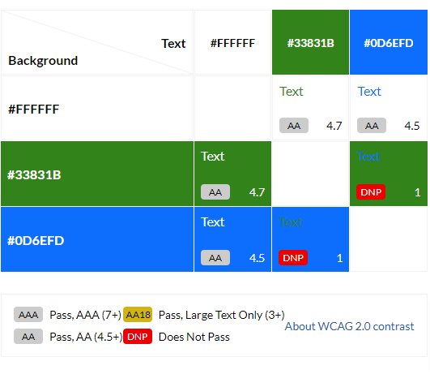

   - The website primarily uses a combination of vibrant colors, including grey and white to create an energetic and engaging visual experience.

   - #d6ffff
   - #41a323
   - #333
   - #ffffff
   - #33831b
   - A mixture of all the above colours were used throughout the site.
 

- ### Typograpy
     All of the fonts were sourced from the [Google Fonts](https://fonts.google.com).

- Main font: Lato.
    -  Lato is used as the main font, for all paragraphs,  
      and links in navbar and footer. lato was chosen because it has 
       modern, clean, and simple style, and following the recommendation in Google fonts of popular pairing font with 
       oswald.  

   -   Oswald and Roboto. 
       Both front are used as the header for the website. It was chosen first, since I wanted to choose a beautiful and impactful font for the heading to give a great first impression of the website from the user’s perspective. 

  -   Lato, Oswald and Roboto were used as main and fallback font.
      Lato and Oswald are clean, modern  and vibrant font that adds to the overall aesthetic and readability of the content.
   
- ### Imagery

   - These images were sourced from [Freepik](https://www.freepik.com), and [Unsplash](https://unsplash.com).  
   - Hero Image is chosen because it’s blends with the tittle, so the heading text can stand out more, and it’s giving a clean and fresh feeling of living “climate change”.
   - All of the images in the website were taken from a free stock-photos website, as representations of what’s inside the shop, to provide clear imagery to the user and let the user know what to expect.

 

[Back to top](https://57esther.github.io/Climate-Change/)  

- ### Wireframes

 - #### Skeleton Plane

  - Wireframes were created using balsamiq to design the navigation and interface of the website. The developer designed it with a good UI design in mind, which allows immediate interaction in first-time learning, and perfectly meets the needs of the intended audience.  

The wireframes can be found in the link below:  

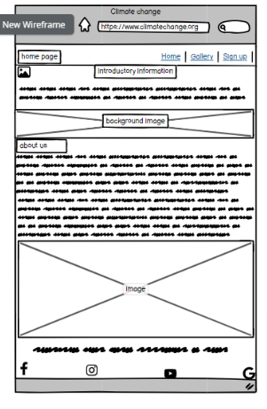
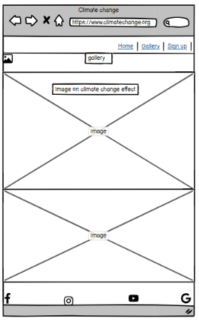
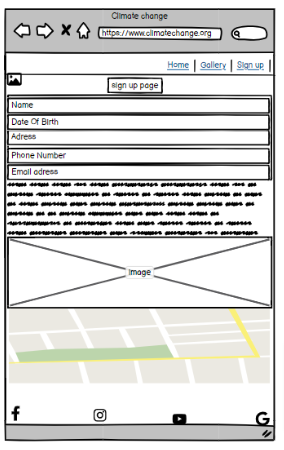

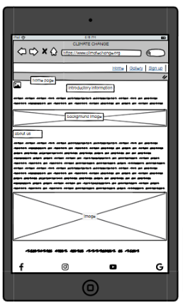
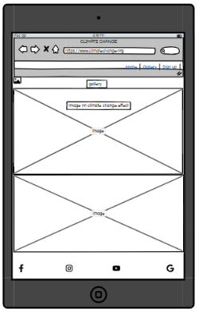
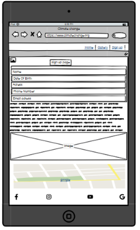

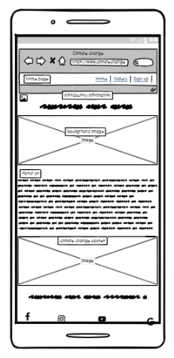
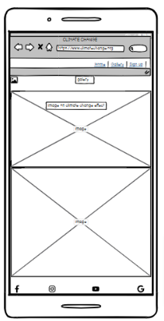
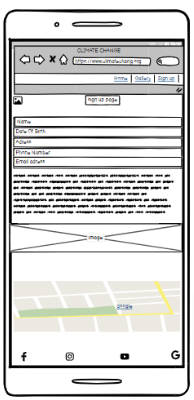

 

- ## Features and Structures.

  - ### Existing Features and Structure.

   - #### Navigation Bar (Navbar).

    - The Navbar consists of a Logo on the left side that links to the top of the site, and three 
     navigation links (nav-bar) on the right side that link to the sections. It occupies 100% width of the site.  
    - The Navbar is fully responsive on all device sizes. On desktop view, the user can see all the    
      links. 
    - The Nav-links have an active state which changes according to which section the user is currently 
     looking at.  
    - The Nav-links have a subtle hover state  when the user hovers over them.  
    - The Navbar is fixed at the top of the user’s device screen, it follows along when the user scrolls 
     down. 

 - #### Home Page 
     - The home page has all the information and detailed ideas about the project.

     - Hero image.
     - The backround image, shows the adverse effects of the cause and danger of climate change.
     - The  two coloured effects shows how quickly actions needs to be taken to keep our planets safe.
     - The choice of hero image showing the liveness and health of the planet through the bubbly tree    
      full of life and then turn into an empty and withered tree portrays a message about the effects of climate change. which makes it a perfect choice for the hero-image.  
    
    - About and Purpose.

     - Easy to read and visible purpose of the site can be seen after the hero image.

    - Causes and Effect.

     - The effect of change can be seen after the purpose of the site.

    - Combacting Climate Issues.

     - Likely solution to the climate change isssues were highlighted in this section.

- #### Gallery and Images of Effects.
    - This section contain Images of some effects of climate and how it afffects things around us.

- ### Images.
   - The images explicit the effects of the climate and the damages it causing our plantes which show the user stories purpose of creating awareness of the problem.

- ### Footer page
  - Each footer page has the iframes showing the map address of meet up location.
  - Socail links, icons for social meida  look up and follow.

 - #### Sign-up.
    - This sections offers an option for sign-up to anyone who wants to know more about the project.
    
- ### Map Iframe Information.

  - The map iframe was created to give credibility to the website, according to finding users are more to engage with a website that has a addresss, hence the reason for incorporating a map address.

  - #### Footer and social links.
    - social link and icons using accessible links to social media pages like facebook etc helps user trust the page and want to engage and find out more on socila media.

     - Shows the the map location.
     - Addition feature to sign up to newsletter to recieve latest updates was also added to offer preference for returning user.
    
- ## Media
 - The following social meida links where visible on the site.
  - Facebook link.
  - Instaram link
  - Twitter link
  - Youtube link
  - Google link

 

- ## Technology Used

   - Languages Used
        -[HTML5]( https://developer.mozilla.org/en-US/docs/Glossary/HTML5)
        -[CSS3]( https://developer.mozilla.org/en-US/docs/Web/CSS)

 - ### Frameworks, Libraries & Programs Used 
   
    1. [bootsrap5](https://getbootstrap.com/ 
      docs/5.0/getting-started/introduction/)  
       Bootstrap 5 was used to assist with the responsiveness and styling of the website.  
    2. [Google Fonts](https://fonts.google.com)  
      Google fonts was used to import the “Lato” and“Oswald” fonts into the html file, and were used on all parts of the site.  
    3. [Font Awesome](https://fontawesome.com)  
       Font Awesome was used throughout the website to add icons for aesthetic and UX purposes.
    4. [Git](https://git-scm.com)  
       Git was used for version control by utilizing the Gitpod terminal to commit to Git and Push to GitHub.  
    5. [GitHub](https://github.com)  
      GitHub was used to store the projects code after being pushed from Git. 
    6. [Balsamiq](https://balsamiq.com/)  
      Balsamiq was used to create the wireframes and the high fidelity mock up during the design process.  
    7. [Am I Responsive](ami.responsivedesign.is)  
      Am I Responsive was used to preview the website across a variety of popular devices. 
    8. [Tiny JPG](https://tinyjpg.com)  
      Tiny JPG was used to reduce the file size of the images.
    9. [contrast-grid.eightshapes](https://contrast-grid.eightshapes.com/)  
       Constract grid was used to create a cohesive color scheme for the website.
    10. [Balsamiq](Wireframe design)
    11. [youtube](https://youtube.come)
        I did lots of personal learning on youtube.
    12. [Gitpod](https://www.gitpod.io/)
        Gitpod was use to finalise and complete the project.
    13. [Code anywhere](https://codeanywhere.com/)
    14. [GoogleDevTools](https://developer.chrome.com/docs/ 
       devtools/) 
    15. [Html corrector](https://www.htmlcorrector.com/) 
    16.  [PageSpeed Insights](https://pagespeed.web.dev/)
    17. [Lighthouse](https://www.google.com/chrome/)

     

- ## Testing and Validation.

 - ### Validation.
   - The website was tested using html and css code validators.
     which show some issues from bootsrap link.
    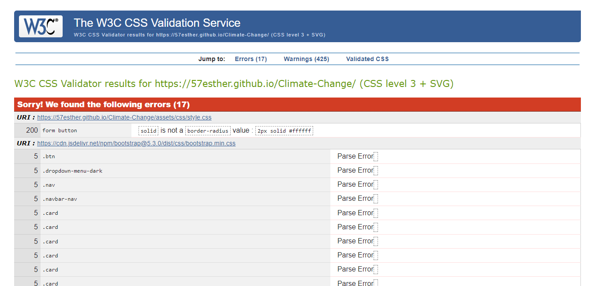
    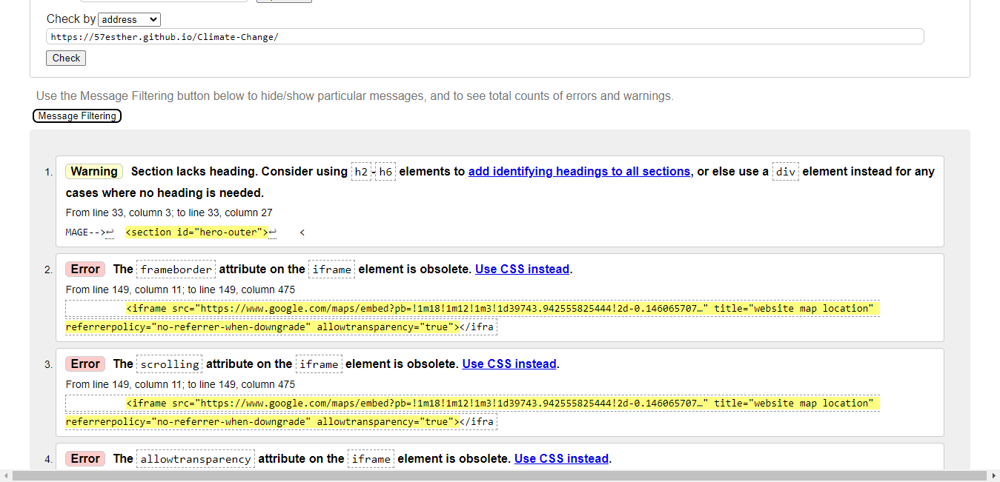
   

  - ### Validated the HTML and CSS code using W3C validators.

   - The website was tested using lighthouse and pagespeed-insight: 
    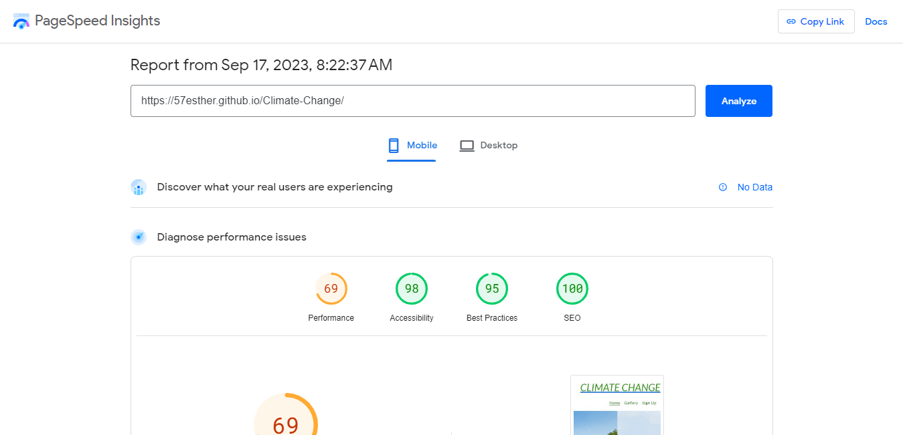
    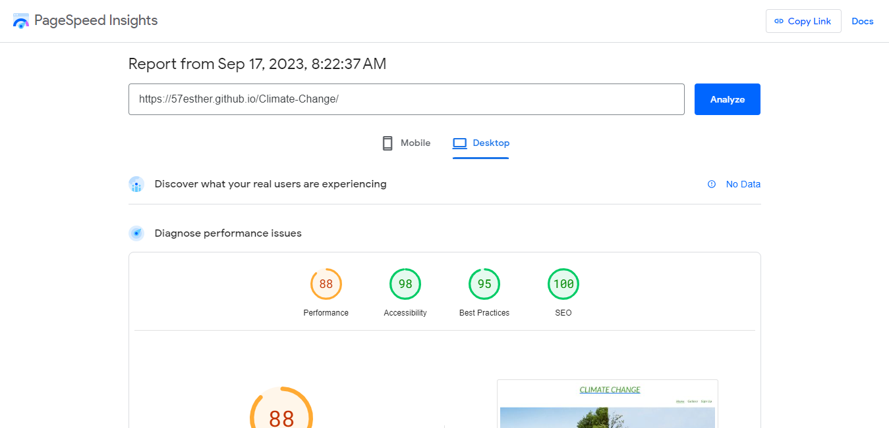
    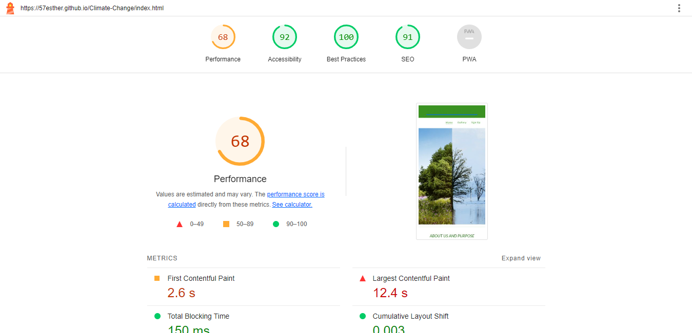
    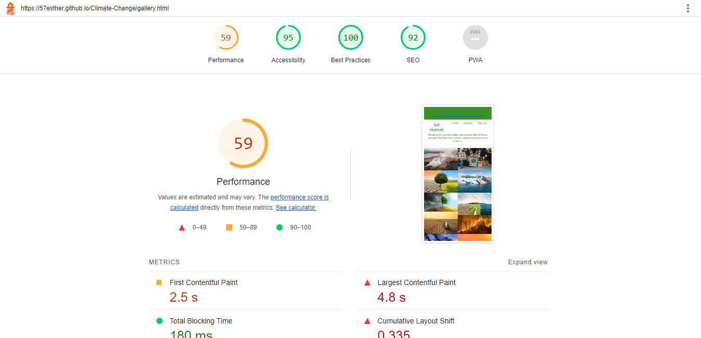
    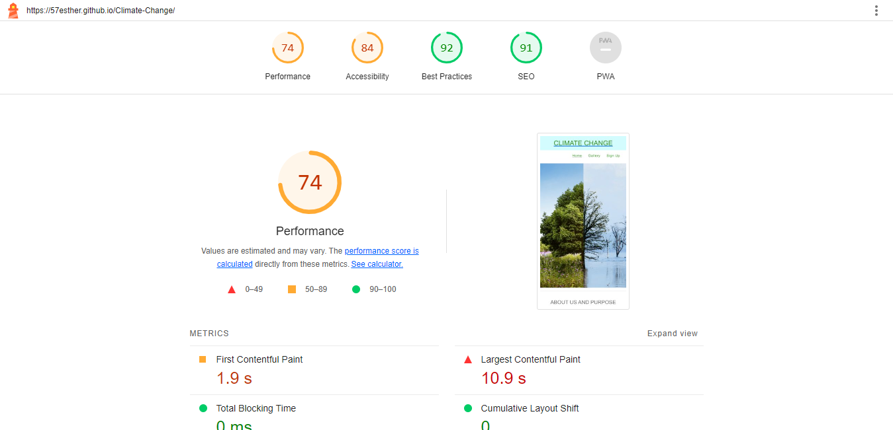
    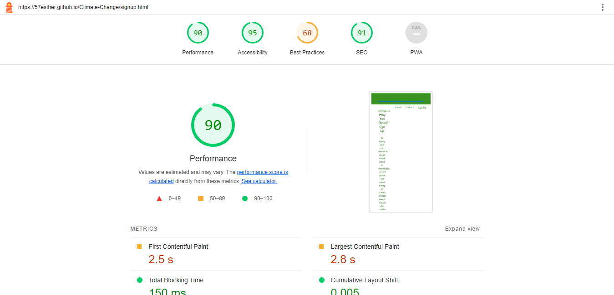
    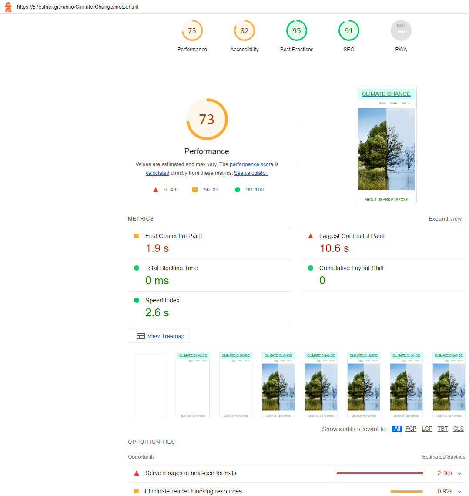

   - ### Retesting and validation.
     - Initially the site was recieving a lot of errors due to an outdated Font awesome link.
     - I struggled with trying to import Font awesome,however managed to stick it through 
     and get the issue resolved.
     
     

     
     

     
     

  - ### Testing for Responsiveness.
   - I tested for responsiveness using am i responsive site with images attached
     here:

  - ### Tested the website on various browsers and devices.

   - ### Destop and Laptop.
    - The website was responsive on various destop and laptop, the home page was well responsive and all features came great and easy to access, the gallery page took few minutes to load images and the sign-up page all allign and fit to content.

     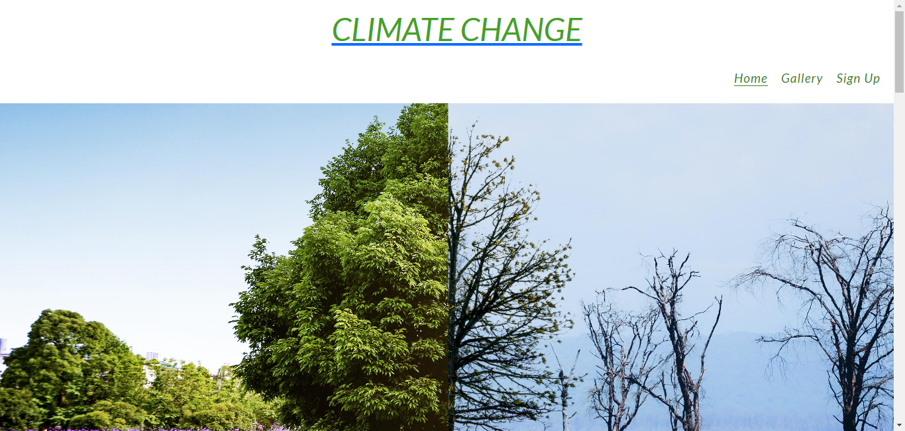
     .png)
     .png)
     
     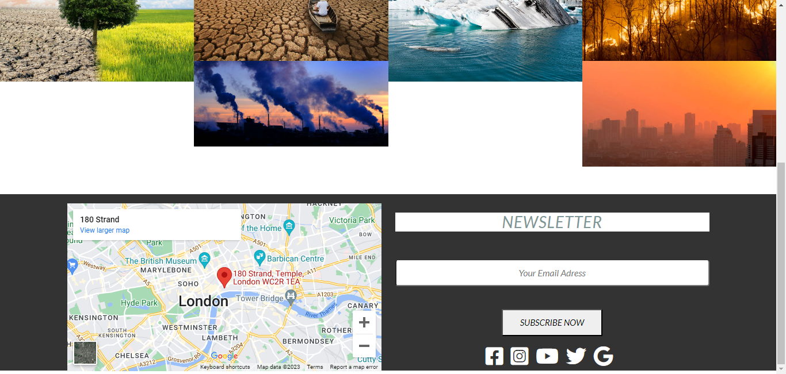
     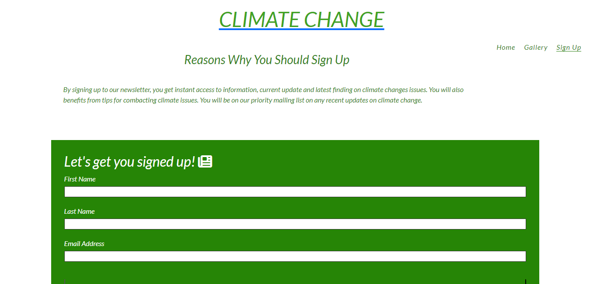
     .png>)
     
   - ### Tablets and Ipads.
  
     - The website was responsive on various tablets and mac, the home page was well responsive and all features came great and easy to access, the gallery page took few minutes to load images and the sign-up page all allign and fit to content. had a bit of issues with the images and sign up page, i inspected using dev tools and fix the issues by reducing the size of images and removing some css styling.

      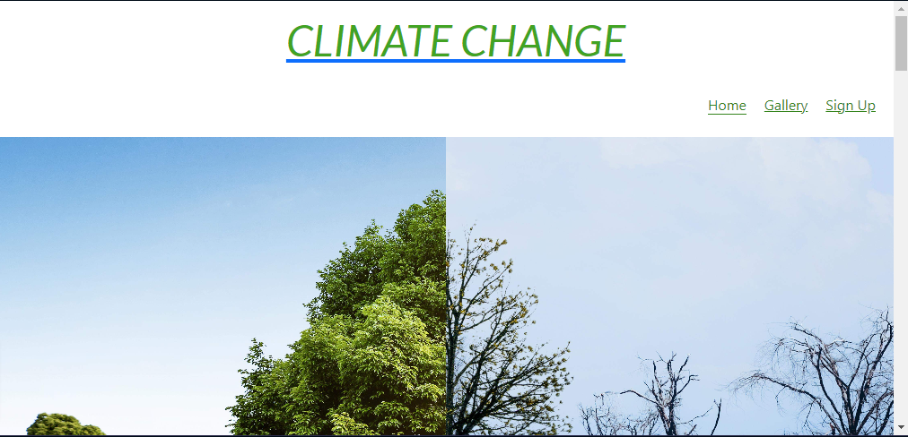
      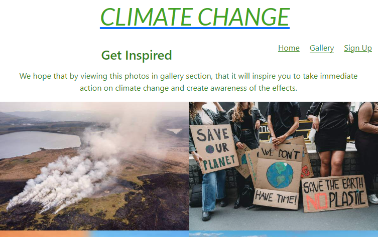
      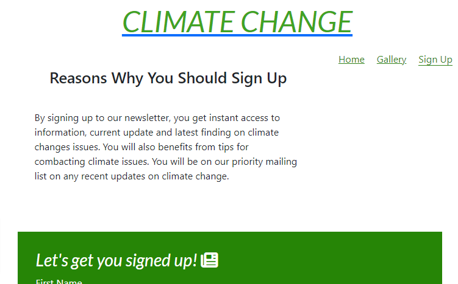
      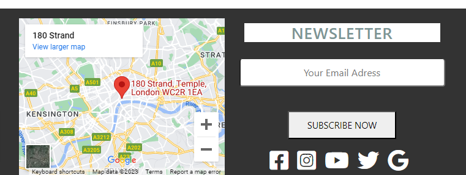

  - ### Mobile Phone.
    - The website was responsive on various mobile phones, the home page was well responsive and all features came out great and easy to access, the gallery page took few minutes to load images and the sign-up page  didnt allign and fit to content. had a bit of issues with the images and sign up page, i inspected using dev tools and fix the issues by reducing the size of images and removing some css styling on the sign-up page.

    
    
    
    

- ### Accessibility Testing.
   - The first testing had some errors and isssues as seen below.
    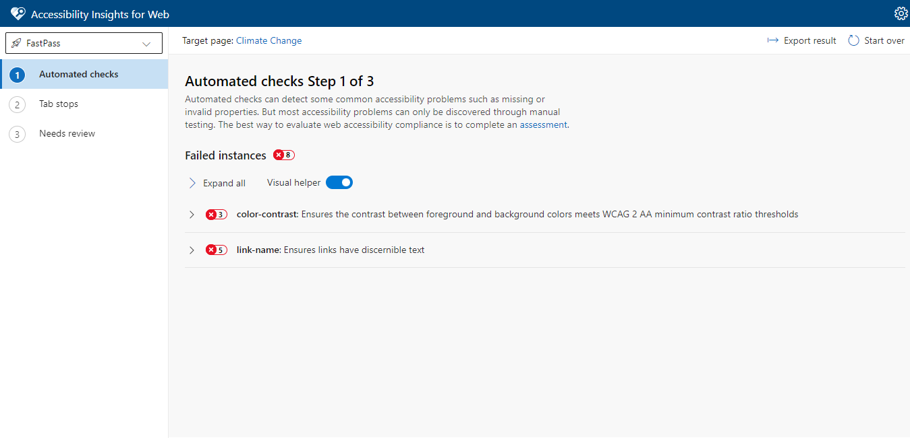

    - I run the test again after fixing some of the issues.
   .png)
   .png)
   .png)
   

  - ### Google Chrome

  
  - ### Opera Mini

  - ### Microsoft Edge

  - ### Conducted user testing with friends and family members.
      - Users enjoyed the sites visuals however later found out that the visuals were taking too much space and were too large. This resulted into compressing the image files which led to the decrease in some image quality. The issues were fix and tested again.

   - ### Testing User Stories from User Experience (UX) Section  

    - #### Visitor Goals.

    - #### First Time Visitors Goals-

      - As a First Time Visitor, I want to easily understand the purpose of the website.
      - As a First Time Visitor, I want to be able to easily navigate throughout the website to find content.
      - As a First Time Visitor, I want to locate their social media links to follow them on social media.
       
      
      
      
      
      

   -  #### Returing Visitors Goals

    - As a returning Visitor, I want to find new information about the website.
    - As a returning Visitor, I want to find the best way to sign up to newsletter on the website.
    - As a returning Visitor, I want to find new updates and links to information.

      
      
      
    -  #### Frequent Visitor Goals

      - As a Frequent Visitor, I want to check to see if there are any newly added resources.
      - As a Frequent Visitor, I want to sign up to newsletter or events to stay updated with   information about improving our planet.
      
      - As a Frequent Visitor, I want to find the best way to locate the events hosted on the website.
    

      .png)
      
      

      

- ## Issues And Bugs.

   - While working on the project, i started with codeanywhere and open my workspace accordingly.
   - I started experiencing difficuities with commiting my change to github, then diverge main and branch issues also came up which took considerably amount of time which should have gone into getting the project ready for submission. Images attached below: 
   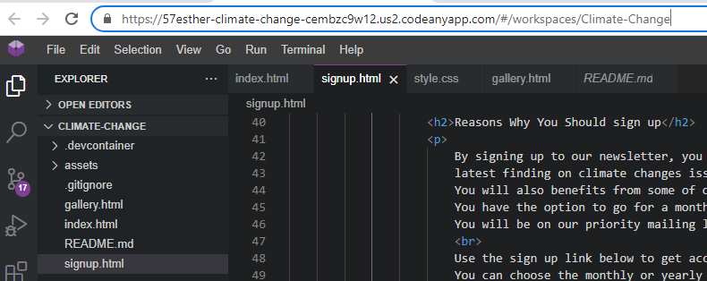
   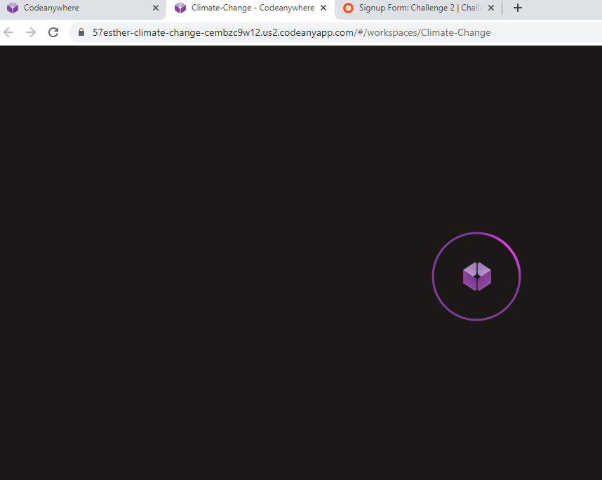
   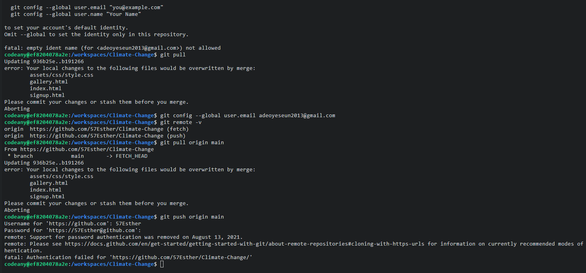

- ### Sign-up Reason
 - I had isssues setting the sign-up reason h2 to fit to the middle of the mobile

- ## Deployment

 -  The project was developed using Gitpod as the code editor, committed to Git as a local 
   repository, and finally pushed/ stored to GitHub. 
 
 - The website was originally created using code anywhere worspace 
    and dev tools, 
    due to lots of issues and bugs, and to meet up with the submission deadline I was advised to download project files and open a new workspace using gitpod  which was used to complete and submit the project.

   - The website is deployed using GitHub Pages, which hosts the 
     project directly from the GitHub repository. Changes made to the repository are automatically reflected on the live site.

   - Getting into the habit of commenting when submitting any 
      changes to the site allowed me to better document the changes I made when creating the site. 
   - Using terminal to pull and push my repository.

The project was developed using Gitpod as the code editor, committed to Git as a local repository, and finally pushed/ stored to GitHub. 

The project was deployed to GitHub Pages using the following steps:
1.	Log in to GitHub.
2.	Navigate to the main page of GitHub Repository that will be deployed.
3.	At the top of the Repository, locate the "Settings" button on the menu and click it.
4.	Inside the Settings, on the left side of the page, there’s a list of tab menu. Locate the “Pages” tab, and click it.
5.	Under "Source", click the dropdown called "None", select "Main branch", and then click the “Save” button.
6.	The page will automatically refresh.
7.	There’s a notification message that provides the now published site link: “Your site is ready to be published at "https://57esther.github.io/Climate-Change/ "
  

- ### Forking the GitHub Repository
By forking the GitHub repository you can make a copy of the original repository on your GitHub account to view and/or make changes without affecting the original repository, by using the following steps:
1.	Log in to GitHub.
2.	Navigate to the main page of the GitHub Repository that you want to fork.
3.	At the top right of the Repository just below your profile picture, locate the "Fork" Button.
4.	You should now have a copy of the original repository in your GitHub account.  

Changes made to the forked repository can be merged with the original repository via a pull request.  

- ## Credits.

 - ### Content.
   - All content was written by Oluwaseun Adeoye
   - The structure of the home page was discuss with my mentor and I decided on the finish looks and 
     colours.
   - The structure of the gallery page was similar to the "Love Runing" page. I followed the same step to 
     create my gallery page and added other features.
   - The sign-up page was created from reading up and looking at other project on github and youtube.
   - Some paragraph was quoted from united nation website.

 - ### Media.
   - All images were sourced from the following site.
    - [logo] (https://logo.com/) 
    - [Freepik](https://www.freepik.com)
    - [Unsplash](https://unsplash.com).  

- ## Acknowledgements.
   - My mentor, Oluwaseun Owonikoko, for the helpful feedback on every detail of the website.
   - Iris Smok, My facilitator for her help and support.
   - Oscar Bartrand, For his help and support.
   - Pri Dom, For his help and support.
   - My husband Joseph, for his daily continuous support and for testing the website across our mobile 
    devices.
   - The Code Institute #peer-code-review channel for feedback.
   - Slack community, as the first help to ask when I encountered a problem.

[Back to top](https://57esther.github.io/Climate-Change/)  

