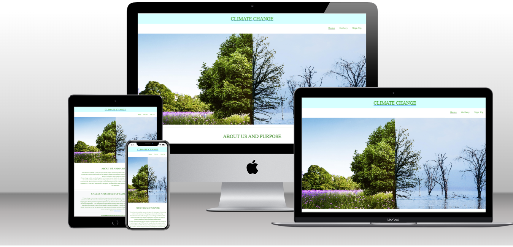

    # Climate Change Website 

      This is the main climate change website, a platform designed to help individuals achieve their goals and make positive changes in their lives by creating awareness of the issues of global warming and how making some simple lifestyle changes can keep our nautral habitat and earth safe which will help improve our planet. 
      This website is responsive and accessible on a range of devices, making it easier for users to navigate and find valuable content.
 
  
     The site address is: [ Climate Chang](https://57esther.github.io/Climate-Change/)

      

## Table of contents

1. [UX](#UX)
   - [Ideal User Demographic](#Ideal-User-Demographic)
   - [Site Purpose](#site-purpose)
   - [User Stories](#User-Stories)
   - [Development Plans](#Development-Plans)
   - [Design](#Designs)
2. [Features](#Features)
   - [Design Features](#Design-Features)
   - [Existing Features](#Existing-Features)
   - [Future Features](#Future-Features)
3. [Issues and Bugs](#Issues-and-Bugs)
4. [Technologies Uesd](#Technoloies-Used)
   - [Main Languages Used](#Main-Language-Used)
   -[Frameworks, Libraries & Programs Used](#Frameworks,-Libraries-&-Programs-Used)
5. [Testing](#Testing)
6. [Deployment](#Deployment)
7. [Credits](#Credits)
   - [Contents](#Credits)
   - [Media](#Media)
   -[Code](#Code)
8. [Acknowledgements](#Acknowledgements)

## UX

### Ideal-User-Demographic
This website targets audience around the world, because of its useful insight, ideas and information. Children and Adult age 10 and above habe found the website infomative and encouraging and finds great insight to help make positive lifestyle change.

### Site Purpose

The purpose of the Climate Change website is  to create awareness of issues affecting the planet and how daily lifestyle change can reduces the effect of these cause globally.

### User Stories

As a user I want:

1. A website that is easy to read and navigate
2. Clear information about the club; where they meet, dates and times, what kind of books are read etc
3. To feel welcome joining a new club

As the develpoer of the wesite I want:

1. To provide clear and relevant information regarding the website
2. To provide a place for people to ask any questions they might have regarding the climate issues

### Goals

#### Visitor Goals.

-  #### First Time Visitors Goals-

    - As a First Time Visitor, I want to easily understand the purpose of the website.
    - As a First Time Visitor, I want to be able to easily navigate throughout the website to find content.
    - As a First Time Visitor, I want to locate their social media links to follow them on social media.

 -  #### Returing Visitors Goals

    - As a returning Visitor, I want to find new information about the website.
    - As a returning Visitor, I want to find the best way to sign up to newsletter on the website.
    - As a returning Visitor, I want to find new updates and  links to information.

-   #### Frequent Visitor Goals

    - As a Frequent Visitor, I want to check to see if there are any newly added resources.
    - As a Frequent Visitor, I want to sign up to newsletter or events to stay updated with information about improving our planet.

    - As a Frequent Visitor, I want to find the best way to locate the events hosted on the website.

-  #### Business Goals

 ##### The business goals are:

- To attract more people who would want to collaborate to bring this project to the world.
- To secure sponsorship opportunity for future development of the project.
- To have new subsriber to increase our targerted audience.

-  ### Development plan

- ### Design

   - #### Colour Scheme

   - The website primarily uses a combination of vibrant colors, including grey and white to create an energetic and engaging visual experience.

   - mint - #
   - black - #333
   - white - #fff
   -
   -
- A mixture of all the above colours were used throughout the site.

- ### Typograpy

-  The main font used throughout the website is Lato, with Oswald as the fallback font. Lato and Oswald is a clean, modern  and vibrant font that adds to the overall aesthetic and readability of the content.
 -Lato is compliment the color of the logo brilliantly, keeping the website consistent throughout.

- ### Imagery
      -

- ### Wireframes

   -

  -

  -

- ## Features

- ## Technology Stack

   - Languages Used
        -[HTML5]( https://developer.mozilla.org/en-US/docs/Glossary/HTML5)
        -[CSS3]( https://developer.mozilla.org/en-US/docs/Web/CSS)

   - Frameworks, Libraries, and Programs Used 
       -[Font Awesome](https://fontawesome.com/)
       -[Git](https://git-scm.com/)
       -[GitHub](https://github.com/)
       -[Gitpod](https://www.gitpod.io/)
       -[Google Chrome DevTools](https://developer.chrome.com/docs/devtools/) 
       -[Google Fonts](https://fonts.google.com/)
       -[Material Design](https://material.io/resources/color/#!/)
       -[Balsamiq](Wireframe design)

- ## Testing

   - ### Validated the HTML and CSS code using W3C validators.
            Initially the site was recieving a lot of errors due to an outdated Font awesome link.
            I struggled with trying to import JS Font awesome, however managed to stick it through and get the issue resolved.

   - ### Tested the website on various browsers and devices with various individuals.
           - Similar issue with Lighthouse. Lighthouse scores were poor, managed to score better when switching to incognito mode. Chrome extensions had an affect on website's performance score.

       - ### Conducted user testing with friends and family members.
             Users enjoyed the sites visuals however later found out that the visuals were taking too much space and were too large. This resulted into compressing the image files which led to the decrease in some image quality.

- ## Deployment
         
         The website was originally created using code anywhere worspace and dev tools,

         The website is deployed using GitHub Pages, which hosts the project directly from the GitHub repository. Changes made to the repository are automatically reflected on the live site.

           Getting into the habit of commenting when submitting any changes to the site allowed me to better document the changes I made when creating the site. 
            Using terminal to pull and push my repository.

